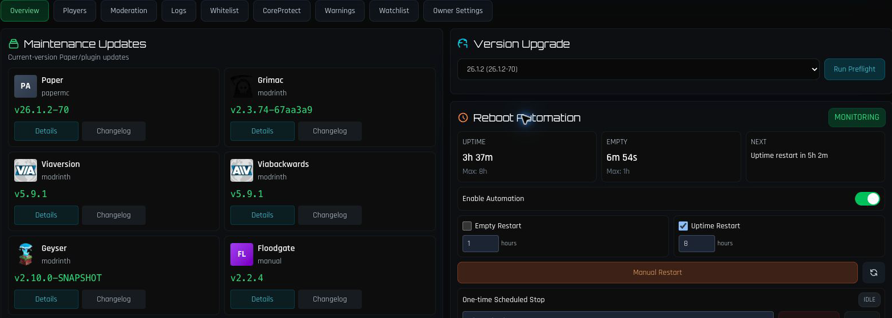
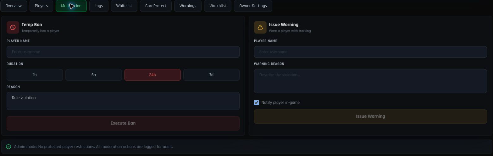
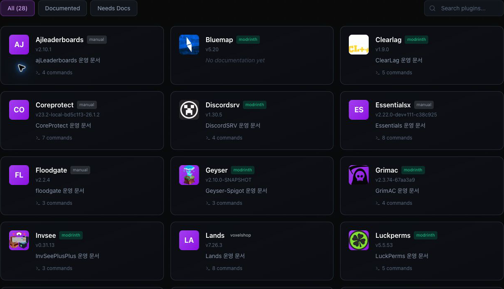
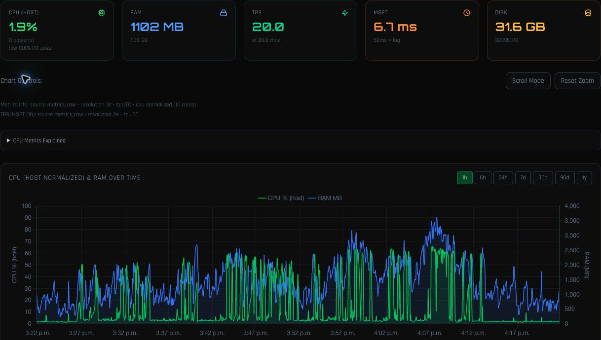
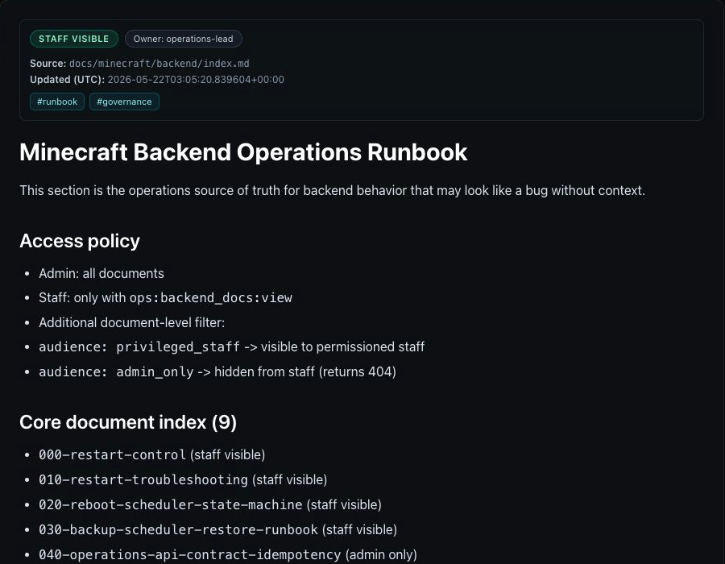
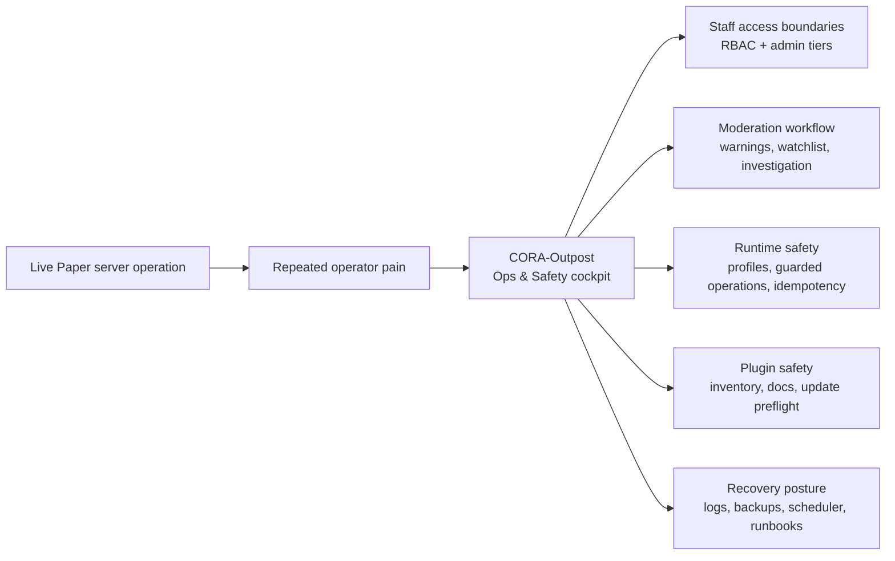
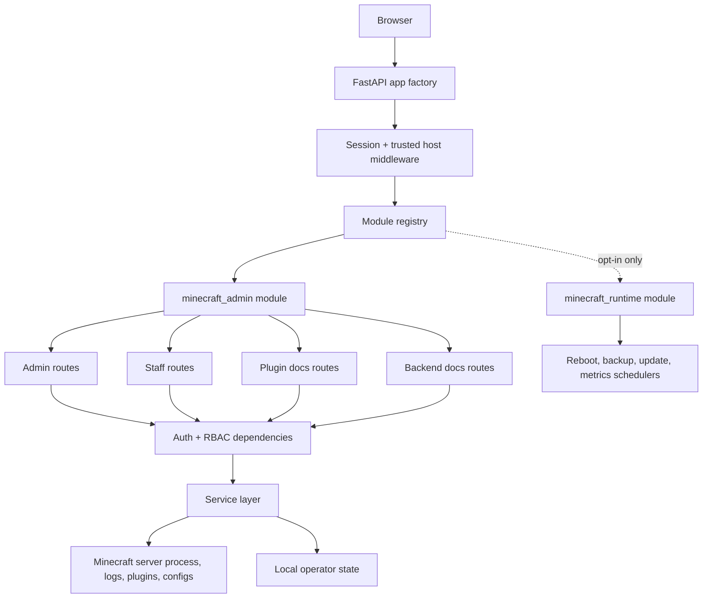
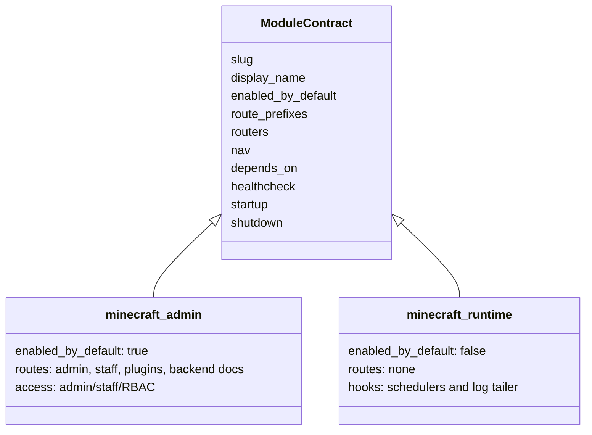
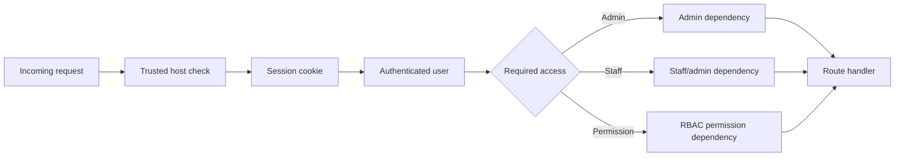
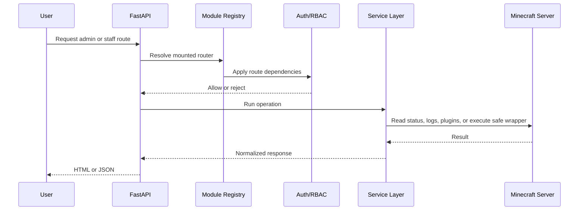

# CORA-Outpost

CORA-Outpost is a security-first Minecraft Paper operations cockpit built from
7 months of live server operation and 6+ months of solo development.

It focuses on the operational problems that generic server panels do not fully
solve: staff permissions, moderation workflows, plugin update safety, redacted
logs, backups, recovery, and runbook-driven operations.

This repository is the public-safe admin and operations extraction from the
larger CORA-live codebase. Internal module identifiers such as
`minecraft_admin` are intentionally kept stable even though the public GitHub
project name is CORA-Outpost.

The repository is intentionally scoped to protected server operations only. It
does not include the public community website, player records, economy, market,
donations, Wrapped pages, portfolio/finance tools, proxy modules, runtime data,
credentials, logs, backups, or incident artifacts.

## Public Preview

CORA-Outpost is currently prepared as a public-safe extraction, not a packaged
one-command demo. The screenshots below are redacted crops from the live operator
workflow: top navigation, account identity, private menus, live logs, player
records, and incident data are intentionally omitted.

| Admin operations | Moderation workflow |
| --- | --- |
|  |  |

| Plugin documentation | Metrics and runbooks |
| --- | --- |
|  |  |



The public preview shows the shape of the product: a protected Minecraft
operations cockpit for plugin safety, staff workflows, metrics, backups,
maintenance, and runbook-driven recovery.

Demo mode is on the roadmap. Until fake fixtures are implemented, live
screenshots are kept narrow and redacted instead of shipping runtime data in the
repository.

## Quick Start

Use the local setup below to verify the application factory and run the admin
surface with placeholder configuration. For a guided preview of what is and is
not safe to show publicly, see [docs/DEMO.md](docs/DEMO.md).

```bash
python3 -m venv .venv
source .venv/bin/activate
pip install -r requirements.txt
cp .env.example .env
SECRET_KEY=replace-with-a-long-random-secret ENABLED_MODULES=minecraft_admin \
  uvicorn app:create_app --factory --host 127.0.0.1 --port 8000
```

## Why This Exists

CORA-Outpost was not designed as another generic hosting panel. It came from
running a live Minecraft server and repeatedly hitting the same operational
questions:

- Who should be allowed to start, restart, stop, or recover the server?
- How should staff actions be bounded so mistakes do not become incidents?
- How can moderation, warnings, whitelist, watchlist, and investigations stay
  visible in one workflow?
- How should plugin updates be checked before they affect the live server?
- How can logs stay useful while avoiding sensitive data exposure?
- How can backup, maintenance, and recovery steps become repeatable?



## What This Project Does

- Provides an admin dashboard for Minecraft Paper server operations.
- Separates admin-only and staff-allowed workflows with RBAC gates.
- Wraps server lifecycle actions such as status, start, stop, restart, and recovery.
- Provides moderation, whitelist, investigation, warnings, and watchlist tools.
- Supports plugin inventory, plugin documentation, update workflows, and Modrinth search/install flows.
- Exposes operational views for metrics, redacted logs, scheduler state, backups, and backend runbook docs.
- Keeps dangerous shell/RCON surfaces disabled in this public extraction.

## Positioning

CORA-Outpost is meant to sit in the operations layer, not to compete as a full
generic game-hosting control panel.

| Area | Generic hosting panels | CORA-Outpost |
| --- | --- | --- |
| Server creation and container hosting | Core focus | Not the main focus |
| File manager and generic console access | Often broad | Safety-focused and intentionally limited |
| Staff workflow | Varies by panel | Core focus |
| Moderation workflow | Often external/plugin-specific | Core focus |
| Plugin update safety | Partial or manual | Core focus |
| Operational runbooks | Usually separate | Built into the admin workflow |
| Dangerous command reduction | Varies | Explicit design goal |
| Origin story | General server management | Built from live Minecraft server operation |

## Companion Project

[CORA-ServerShop](https://github.com/TodLop/CORA-ServerShop) is a companion
Paper plugin that demonstrates the kind of server-specific plugin CORA-Outpost
is designed to operate around: economy features, permission-backed perks,
plugin documentation, configuration safety, and staff-facing operational
runbooks.

CORA-Outpost does not require CORA-ServerShop, but the two projects together
show the full pattern: a protected operations cockpit plus a custom Minecraft
plugin layer.

## Architecture



The application starts in `app/__init__.py`, installs middleware, mounts static
assets, registers auth/status routes, and then asks the module registry to mount
only the enabled modules.

## Modular Design

Modules use a small `ModuleContract` object that declares route prefixes,
routers, navigation metadata, dependencies, health checks, and optional lifecycle
hooks. This keeps public extraction boundaries explicit and testable.



### Included Modules

| Module | Default | Purpose |
| --- | --- | --- |
| `minecraft_admin` | Enabled | Admin dashboard, staff panel, plugin docs, backend runbook docs |
| `minecraft_runtime` | Disabled | Optional startup/shutdown hooks for schedulers, metrics, backups, updates, and log tailing |

`ENABLED_MODULES` defaults to `minecraft_admin`. Broad module enablement with
`*` or `all` is ignored by design, so an accidental environment value cannot
mount excluded surfaces.

## Functional Areas

### Admin Operations

- Server status and health checks
- Start, stop, restart, recover, and operation profile handling
- Log viewing with path traversal guards
- Scheduler, reboot, backup, and maintenance controls
- Update automation and preflight checks
- Plugin inventory, install/update helpers, and documentation pages

### Staff Tools

- Staff-scoped Minecraft panel
- Moderation workflows such as kick, tempban, warnings, whitelist, watchlist,
  notes, investigation, and autocomplete helpers
- Staff preferences and settings

### Documentation Surfaces

- Plugin documentation pages
- Backend runbook documentation
- Access controlled documentation APIs

## Security Model



Security-oriented defaults:

- `SECRET_KEY` is required at startup.
- FastAPI docs and redoc are disabled.
- Admin and staff routes require authenticated sessions.
- Minecraft management APIs use role and permission dependencies.
- Arbitrary RCON command execution is disabled.
- RCON password generation is disabled.
- Browser terminal/PTTY access is not included.
- Public, economy, market, record, Wrapped, portfolio, finance, and proxy modules
  are not present in this extraction.

## Data Hygiene

This repository is designed to be publishable without local operational data.

Excluded from the public extraction:

- `.env` files and local secrets
- OAuth client files, tokens, service account files, and private keys
- Minecraft runtime data, logs, backups, and incident artifacts
- Local machine paths and live identity defaults
- Build outputs, generated caches, IDE metadata, and plugin build artifacts
- Private CORA-live modules outside the Minecraft admin scope

The hygiene checker scans tracked and untracked public candidates for excluded
paths, filenames, module names, route names, and sensitive text patterns.

## Request Flow



## Repository Layout

```text
app/
  core/                 Auth, config, deployment identity, access helpers
  modules/              Module contracts, registry, admin/runtime modules
  routers/              FastAPI route surfaces
  services/             Minecraft operations, RBAC, updates, metrics, docs
  static/               Local UI assets
  templates/            Admin, staff, plugin, docs, and status templates
scripts/
  check_public_extract.py
tests/
  Public extraction, auth, operation, scheduler, update, and security tests
```

## Local Setup

```bash
python3 -m venv .venv
source .venv/bin/activate
pip install -r requirements.txt
cp .env.example .env
python3 - <<'PY'
from app import create_app
app = create_app()
print(app.title)
PY
```

Run locally:

```bash
uvicorn app:create_app --factory --host 127.0.0.1 --port 8000
```

## Public Hygiene Check

Before publishing or pushing a mirror, run:

```bash
python3 scripts/check_public_extract.py
python3 -m pytest tests/test_public_extract_scope.py
```

The checker fails on common private paths, live identity defaults, excluded modules/routes, terminal shell surfaces, generated caches, and broad module defaults.

For a fuller confidence check, run the complete test suite:

```bash
SECRET_KEY=replace-with-a-long-random-secret ENABLED_MODULES=minecraft_admin python3 -m pytest
```

## Safety Defaults

- `ENABLED_MODULES` defaults to `minecraft_admin` only.
- `minecraft_runtime` is opt-in for local operators.
- `*` and `all` module enablement are ignored.
- Arbitrary RCON command execution and RCON password generation are disabled in this public extraction.
- Browser terminal/PTTY access is excluded.

## License

This project is licensed under the Apache License, Version 2.0. See
`LICENSE` for the full license text.

Third-party libraries and vendored browser assets remain under their own
licenses. See `THIRD_PARTY_NOTICES.md` for a best-effort summary of direct
dependencies and bundled frontend assets.

## Publication Checklist

- Run `python scripts/check_public_extract.py`.
- Run `python -m pytest tests/test_public_extract_scope.py`.
- Confirm `git status --short --ignored` is clean.
- Confirm `git remote -v` is empty before intentionally adding a new GitHub remote.
- Review `.env.example` and keep only placeholders or example values.
- Review `LICENSE` and `THIRD_PARTY_NOTICES.md` before publishing a new mirror.
