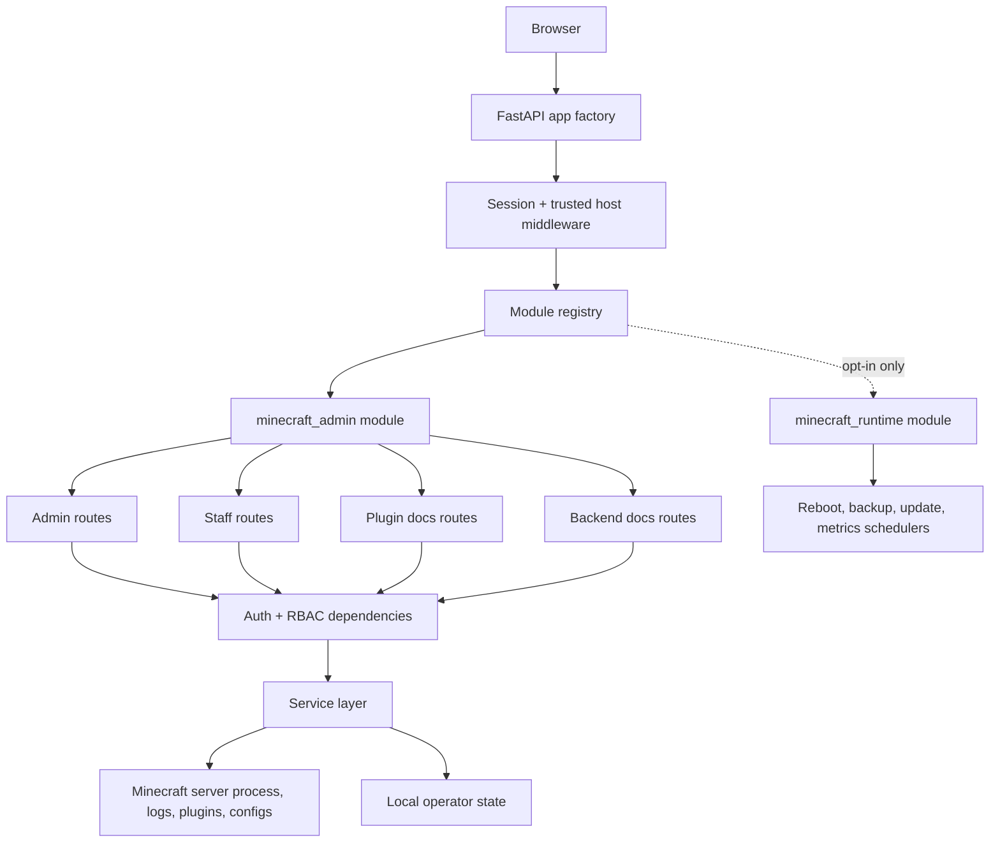
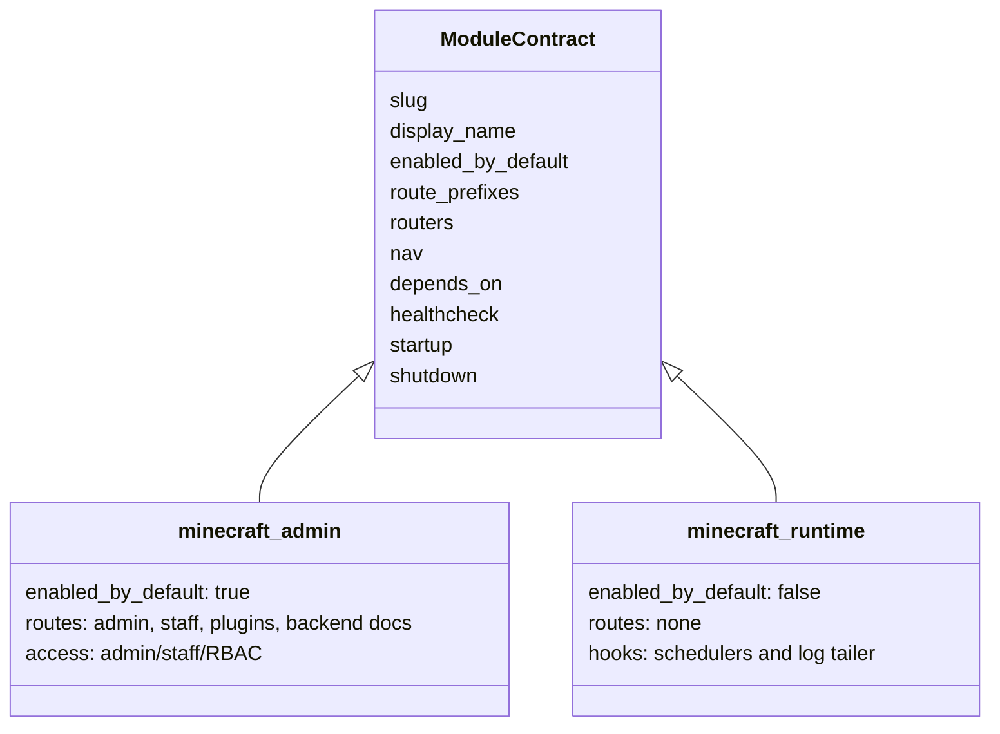
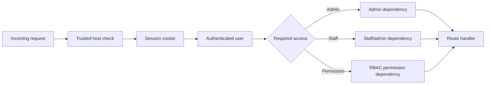
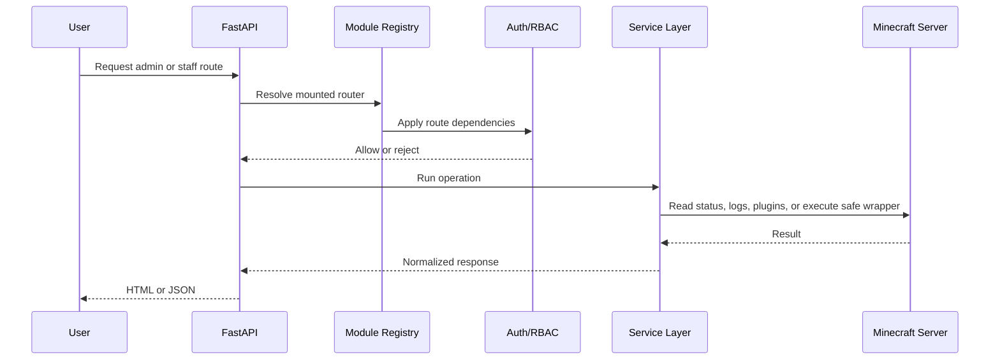

# CORA Minecraft Admin

CORA Minecraft Admin is a FastAPI-based operations dashboard for a Minecraft
Paper server. It was extracted from the larger CORA-live codebase as a
public-safe, admin-focused repository.

The repository is intentionally scoped to protected server operations only. It
does not include the public community website, player records, economy, market,
donations, Wrapped pages, portfolio/finance tools, proxy modules, runtime data,
credentials, logs, backups, or incident artifacts.

## What This Project Does

- Provides an admin dashboard for Minecraft Paper server operations.
- Separates admin-only and staff-allowed workflows with RBAC gates.
- Wraps server lifecycle actions such as status, start, stop, restart, and recovery.
- Provides moderation, whitelist, investigation, warnings, and watchlist tools.
- Supports plugin inventory, plugin documentation, update workflows, and Modrinth search/install flows.
- Exposes operational views for metrics, redacted logs, scheduler state, backups, and backend runbook docs.
- Keeps dangerous shell/RCON surfaces disabled in this public extraction.

## Architecture



The application starts in `app/__init__.py`, installs middleware, mounts static
assets, registers auth/status routes, and then asks the module registry to mount
only the enabled modules.

## Modular Design

Modules use a small `ModuleContract` object that declares route prefixes,
routers, navigation metadata, dependencies, health checks, and optional lifecycle
hooks. This keeps public extraction boundaries explicit and testable.



### Included Modules

| Module | Default | Purpose |
| --- | --- | --- |
| `minecraft_admin` | Enabled | Admin dashboard, staff panel, plugin docs, backend runbook docs |
| `minecraft_runtime` | Disabled | Optional startup/shutdown hooks for schedulers, metrics, backups, updates, and log tailing |

`ENABLED_MODULES` defaults to `minecraft_admin`. Broad module enablement with
`*` or `all` is ignored by design, so an accidental environment value cannot
mount excluded surfaces.

## Functional Areas

### Admin Operations

- Server status and health checks
- Start, stop, restart, recover, and operation profile handling
- Log viewing with path traversal guards
- Scheduler, reboot, backup, and maintenance controls
- Update automation and preflight checks
- Plugin inventory, install/update helpers, and documentation pages

### Staff Tools

- Staff-scoped Minecraft panel
- Moderation workflows such as kick, tempban, warnings, whitelist, watchlist,
  notes, investigation, and autocomplete helpers
- Staff preferences and settings

### Documentation Surfaces

- Plugin documentation pages
- Backend runbook documentation
- Access controlled documentation APIs

## Security Model



Security-oriented defaults:

- `SECRET_KEY` is required at startup.
- FastAPI docs and redoc are disabled.
- Admin and staff routes require authenticated sessions.
- Minecraft management APIs use role and permission dependencies.
- Arbitrary RCON command execution is disabled.
- RCON password generation is disabled.
- Browser terminal/PTTY access is not included.
- Public, economy, market, record, Wrapped, portfolio, finance, and proxy modules
  are not present in this extraction.

## Data Hygiene

This repository is designed to be publishable without local operational data.

Excluded from the public extraction:

- `.env` files and local secrets
- OAuth client files, tokens, service account files, and private keys
- Minecraft runtime data, logs, backups, and incident artifacts
- Local machine paths and live identity defaults
- Build outputs, generated caches, IDE metadata, and plugin build artifacts
- Private CORA-live modules outside the Minecraft admin scope

The hygiene checker scans tracked and untracked public candidates for excluded
paths, filenames, module names, route names, and sensitive text patterns.

## Request Flow



## Repository Layout

```text
app/
  core/                 Auth, config, deployment identity, access helpers
  modules/              Module contracts, registry, admin/runtime modules
  routers/              FastAPI route surfaces
  services/             Minecraft operations, RBAC, updates, metrics, docs
  static/               Local UI assets
  templates/            Admin, staff, plugin, docs, and status templates
scripts/
  check_public_extract.py
tests/
  Public extraction, auth, operation, scheduler, update, and security tests
```

## Local Setup

```bash
python -m venv .venv
source .venv/bin/activate
pip install -r requirements.txt
cp .env.example .env
python - <<'PY'
from app import create_app
app = create_app()
print(app.title)
PY
```

Run locally:

```bash
uvicorn app:create_app --factory --host 127.0.0.1 --port 8000
```

## Public Hygiene Check

Before publishing or pushing a mirror, run:

```bash
python scripts/check_public_extract.py
python -m pytest tests/test_public_extract_scope.py
```

The checker fails on common private paths, live identity defaults, excluded modules/routes, terminal shell surfaces, generated caches, and broad module defaults.

For a fuller confidence check, run the complete test suite:

```bash
SECRET_KEY=replace-with-a-long-random-secret ENABLED_MODULES=minecraft_admin python -m pytest
```

## Safety Defaults

- `ENABLED_MODULES` defaults to `minecraft_admin` only.
- `minecraft_runtime` is opt-in for local operators.
- `*` and `all` module enablement are ignored.
- Arbitrary RCON command execution and RCON password generation are disabled in this public extraction.
- Browser terminal/PTTY access is excluded.

## Publication Checklist

- Run `python scripts/check_public_extract.py`.
- Run `python -m pytest tests/test_public_extract_scope.py`.
- Confirm `git status --short --ignored` is clean.
- Confirm `git remote -v` is empty before intentionally adding a new GitHub remote.
- Review `.env.example` and keep only placeholders or example values.
- Decide whether to add a license before making the repository public.
