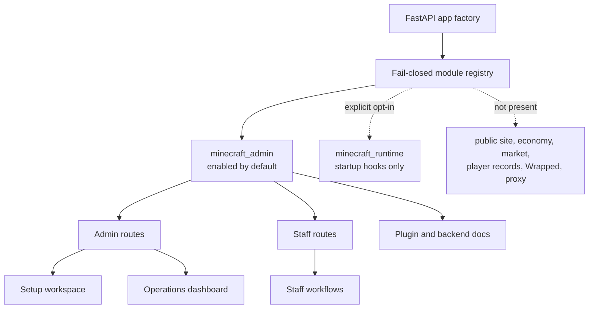
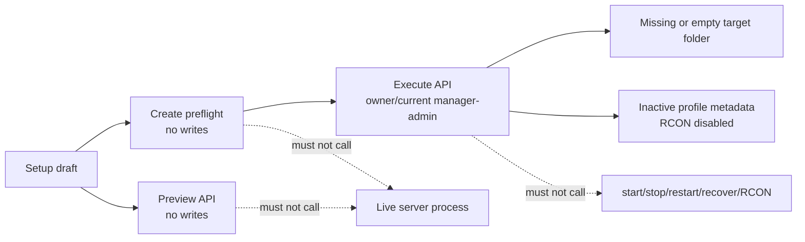

# Public Extraction Architecture

CORA-Outpost is a sanitized Minecraft admin extraction from a larger private
codebase. The public repository keeps the admin and staff operation surfaces,
but excludes public-site, economy, market, player-record, Wrapped, portfolio,
finance, proxy, terminal, runtime-data, and incident surfaces.

## Module Boundary

`ENABLED_MODULES` defaults to `minecraft_admin`. Broad values such as `all` or
`*` are ignored so accidental environment values cannot mount excluded modules.

## Trust Boundaries

- Browser sessions enter through FastAPI session middleware and trusted-host
  checks.
- Admin routes require Minecraft admin access.
- Staff routes require staff/admin access and, for narrower actions, RBAC
  permissions.
- Setup creation is stricter than setup preview: execute requires owner/current
  manager-admin access, `application/json`, and `X-CORA-Setup-Intent:
  create-server`.
- Runtime hooks are disabled by default and only start if `minecraft_runtime`
  is explicitly enabled.

## Setup Boundary

The setup workspace is intentionally not a general file manager and not an
existing-folder registration wizard. It creates a new Paper server layout only
after preflight approves the current draft.

## Data Hygiene

The public repository must not include runtime or local operator data:

- `.env`, OAuth files, tokens, service accounts, private keys
- Minecraft logs, backups, live server folders, generated Paper jars
- Setup claim files, staging ledgers, `eula.txt`, generated `server.properties`
- Local absolute paths and live identity defaults
- Private modules from the larger codebase

`scripts/check_public_extract.py` scans tracked and untracked public candidates
for blocked paths, file names, module names, route names, sensitive text
patterns, and unexpected git remotes.
